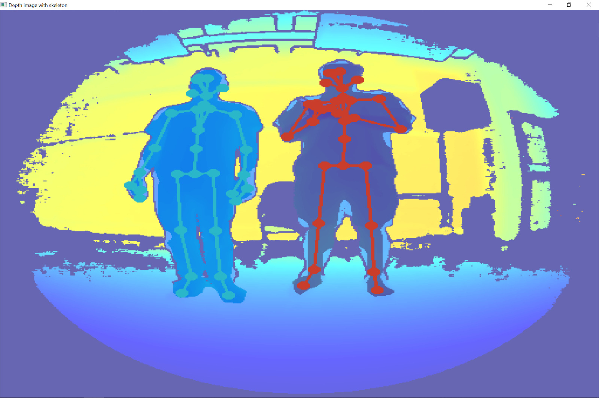

# BodyTracking-Kinect-EEG

## Para correr
- [Azure Kinect Viewer SDK](https://learn.microsoft.com/en-us/azure/kinect-dk/azure-kinect-viewer)
- [Azure Kinect Body Tracking Viewer SDK](https://learn.microsoft.com/en-us/azure/kinect-dk/body-sdk-download)
- Instalar los modulos de python necesarios
- `py {nombre_del_script.py}`

## Códigos para la conexión del EEG con visión computacional.
Este repo tiene una serie de códigos, los cuales van a ser usados para conectar el body tracking con el eeg, esto para poder tener una correlación con los datos registrados en el eeg con la visualización del movimiento físico del sujeto.

- k_depth_skeleton.py
Ejemplo directo de PyKinect para body tracking con depth (Usar este)
- k_basic.py
Utiliza pyk4a, es simplemente visión básica
- k_body.py
(A veces no funciona) Utiliza pykinect_azure, permite el traqueo de esqueleto con diferentes camaras
- k_pointcloud.py
idk sorry no me acuerdo

## pip modules
pyk4a
pykinect_azure
opencv-python

## Ejemplos de PyKinect
[PyKinect Examples](https://github.com/ibaiGorordo/pyKinectAzure/tree/master/examples)
